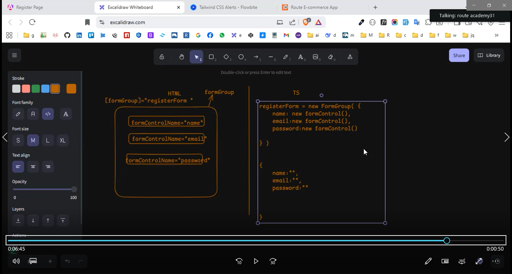
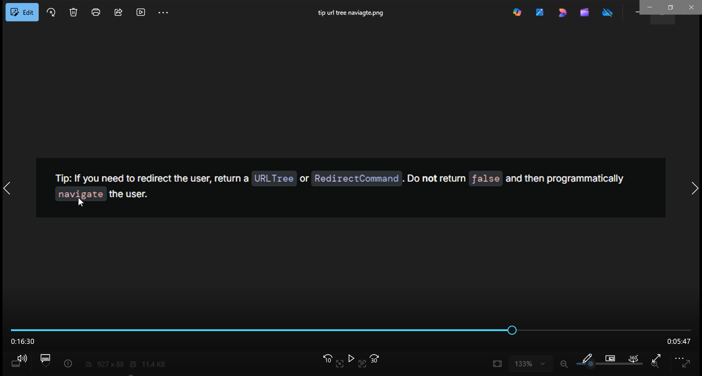

**هنا هكتب الملحظات ك كود في الكشكول الكلام الي بيفهمني**
**اول ملاحظه**
```ts
    {
    path: '**',
    renderMode: RenderMode.Client
    // bad SEO
  }
      {
    path: '**',
    renderMode: RenderMode.Server
    // god Seo
  }
```
***
**الملاحظه الثانيه**
```ts
//befor (bad becuuse don't type) angular20+
"schematics": {},
//بعد التعديل
      "schematics": {
        "@schematics/angular:component": {
          "type": "component"
        },
        "@schematics/angular:interface": {
          "type": "interface"
        },
        "@schematics/angular:service": {
          "type": "service"
        } 
      },
```
**الملاحظه الثالثه**
```ts
// last stracture flowbites
  constructor(private flowbiteService: FlowbiteService) {}

  ngOnInit(): void {
    this.flowbiteService.loadFlowbite((flowbite) => {
      initFlowbite();
    });
  }
  ```
  **الملاحظه الرابعه**
   ```ts
   //Import BrowserAnimationsModule into AppModule unless it is imported
   //app.config
   import{provideAnimations} from '@angular/platform-browser/animations'
   providers: [
    provideAnimations(),
   ]
```
**الخامسه**
```ts
        {path:'details/:id/:slug', component:DetailsComponent, title:'Details Page'},
//         معناها اني هبعت بعدها الid
// وبعده هبعت slug
// ولازم ابعتهم الاتنين عشان ده النوع parm==parametard
//كدا انا حفظته اني في داتا جايه
[routerLink]="['/details', proudct.id , proudct.slug]">
//دي بكتبها في card.html
// بقوله وديني لصفحه ال  details
//وانا رايح ابعت معاك ال id,slug
// وممكن اعملها كدا عادي
routerLink="/details/{{proudct.id}}">
//دي حركه صايعه بحيث لو مبعتش slug يشتغل برضو دي اكنها query parametars 
        {path:'details/:slug/:id', component:DetailsComponent, title:'Details Page'},
        {path:'details/:id', component:DetailsComponent, title:'Details Page'},
//دي اسمها dymamic routing بستخدمها لو عاوز ابعت حاجه في ال url


```
**السادسه**
```ts
  private readonly activatedRoute =inject(ActivatedRoute)
//دي سرفس بتجيبلك كل المعلومات عن  routing الحالي 
this.activatedRoute.paramMap==    this.activatedRoute.params
//بس parms دي كنت ماقبل ang7 ومش امان وش حلوه الافضل parmMap
this.activatedRoute.paramMap.subscribe({

})
//عمل subscripe عشان كل لما يجي يغير في حاجه الداله تحس ف تقرا تاني يعني عشان تتابع التغيرات 
  id: string |null = null;
//النوع string او null انا عرفاها من اني وقفت علي ال git لقيتها بترجع string,null
// ايه الفرق بين 
//1
  getIdUrl():void{
    this.activatedRoute.paramMap.subscribe({
      next:(urlParms)=>{
        this.id=urlParms.get("id")
        // console.log(urlParms.get("id"))

      }
    })
  }
  //2 
  getIdUrl():void{
    this.activatedRoute.snapshot.paramMap.get('id')
  }
  //اولا الاتنين كدا شغالين 
  //بس في 1 ال subscripe بتتابع اي نعديلات بتحصل يعني لو id اتغبر هي بتحس وتغير 
  //في 2 بقا ال snapShot مش بتحس بتغيرات بتحصل هي بتاخد ال id وتحزنه وحلاص ولو غيرت مش بتحس بالتغير اكنك عملت اسكرين شوت
//في البروجكت ده مش فارقه معايا لاني مفيش تغيير هيحصل في id بش الافضل تريح دماغك وتشتغل ب 2
//في مشاريع بتكون اصلا عاوزه لو ال path اتغير اعمل حاجه فيها دي لازم subscripe
// طوات
```
**paginations**
```ts
//اول حاجه الباك اند بيبعتها ك parmetars
https://ecommerce.routemisr.com/api/v1/products?page=2 
//هنلاقي انو بيبعتوا في حاجه اسمها page
//هنروح بقا ل services اعدلها عشان تاخد مني ال page في ال api
//قبل 
  getAllProducts():Observable<any>{
return this.HttpClient.get( environment.baseUrl + 'products')
  }
  //بعد
    getAllProducts(pageNumber:number=1):Observable<any>{
return this.HttpClient.get( environment.baseUrl + `products?page=${pageNumber}`)
  }
  //الي حصل بقا اني خليت في ال api اني ابعت رقم الصفحه واديتها قيمه ب 1 عشان لو مبعتش ميضربش ايرور في الباقي 
  //الخطوه الي بعد كدا هروح ل ts للي عاوز استخدم فيه ال pagination
  //قبل 
    getAllProudctsData():void{
    this.ProudctsService.getAllProducts().subscribe({})
    //بعد 
      getAllProudctsData(pageNumber:number=1):void{
    this.ProudctsService.getAllProducts(pageNumber).subscribe({})
//الي انا عملته اني خليت دي  getAllProudctsData() تاخد مني رقم الرقم ده هبعته لي getAllProducts(pageNumber) ف دي تبعته ل ال getAllProducts بتاع services api
//الحطوه الي بعد كدا الربط امشي مع موقع ngx pagination
| paginate: { id: 'foo',
                                                      itemsPerPage: pageSize,
                                                      currentPage: p,
                                                      totalItems: total }"
                                                      هبعت دول في الي ان عاوز استخدم عليهم 
                                                      //بقت كدا 
   
@for (proudct of proudctList | paginate: { id: 'foo',
                                                      itemsPerPage: pageSize,
                                                      currentPage: p,
                                                      totalItems: total } ; track proudct.id) {
   
<app-card [proudct]="proudct"></app-card>
//الخطوه الي بعت كدا ال pagination نفسه بقا 
//هكتب ده في اي مكان 
<pagination-controls  id="some_id"
                      (pageChange)="pageChanged($event)"
                      (pageBoundsCorrection)="pageChanged($event)"
                      maxSize="9"
                      directionLinks="true"
                      autoHide="true"
                      responsive="true"
                      previousLabel="Previous"
                      nextLabel="Next"
                      screenReaderPaginationLabel="Pagination"
                      screenReaderPageLabel="page"
                      screenReaderCurrentLabel="You're on page">
</pagination-controls>
//هاخد دول بس منو 
  <pagination-controls  id="foo"
                      (pageChange)="getAllProudctsData($event)"


>
</pagination-controls>
//اصبح عندي 
<div class="flex justify-center mt-4 ">
  <pagination-controls  id="foo"
                      (pageChange)="getAllProudctsData($event)"
                      // ال (pageChange) ده عباره عن حدث بيشتغل كل لما اغير الصفحه 
                      //اول لما اغير الحدث ده يحس ف يشتغل ف ينادي علي الفانكشن دي getAllProudctsData($event) الفانكشن دي انت عارف انها مستنيه منك رقم الصفحه ف هبعتها ب $event ده شايل رقم الصفحه معلومات ال event يعني 
 

>
</pagination-controls>
</div>
//لو عاوز اظبط بقا الديزاين همشي ورا الموقع 
//هكتب ده في ال component style مش الجلوبل 
<style>
  .my-pagination ::ng-deep .ngx-pagination .current {
    background: red;
  }
</style>
//ده ليه بقا تعاله نفهم 
//1-انا مقدرش اغير ال style بتاع com من com اخر ليه لاني بيكون معموله كبسله يعني تغليف ف انا بديله الكلاس ده    .my-pagination وبقوله خش جواه من خلال   ::ng-deep يعني من غير ::ng-deep مش هيشتغل 

</pagination-controls>
//اصبح عندي 
<div class="flex justify-center mt-4 ">
  <pagination-controls class="my-pagination"  id="foo"
  //كدا انا اديته الكلاس الي هغير بيه 
                      (pageChange)="getAllProudctsData($event)"

>
</pagination-controls>
```
**forms**
```ts
//خطوات formControl
 //دي لو control واحد بس (input يعني)

 1- import { FormControl, ReactiveFormsModule, Validators } from "@angular/forms";
 2- email:FormControl= new FormControl("ahmed", [Validators.required , Validators.email ]) 
 3- <input [formControl]="email">
 console.log(this.email) //ده بيعرض كل معلومات ال control من valid وكدا بستخدمه في validations 
 //خطوات form group
 //دي لو اكتر من control(input يعني)
 ```


**steps of confirmPassword**
```ts
//1- هعمل فانكشن تشوف قيمه ال pass=repss
  confirmPassword(group:AbstractControl){
       return  group.get('password')?.value===group.get('rePassword')?.value ? null : {mismatch:true};
       //لو مش بيساوي رجع {} هرجع{} لاني ال error الخاصه ب formGroup بترجع في {} وانا عاوزها في ايرورز الفورم جروب عشان دي هي دي الي بيحصل فيها custom validations

  }
  //بعد كدا هنربط بقا بفورم جروب
    registerForm:FormGroup = new FormGroup({
    name:new FormControl(null , [Validators.required, Validators.minLength(3), Validators.maxLength(20)]),
    email:new FormControl(null , [Validators.required, Validators.email]),
    password:new FormControl(null , [Validators.required, Validators.pattern(/^(?=.{8,})((?=.*\d)|(?=.*\W))(?!.*[.\n])(?=.*[A-Z])(?=.*[a-z]).*$/)]),
    rePassword:new FormControl(null , [Validators.required, Validators.pattern(/^(?=.{8,})((?=.*\d)|(?=.*\W))(?!.*[.\n])(?=.*[A-Z])(?=.*[a-z]).*$/)]),

  },{validators:this.confirmPassword});
  //لو بصيت هتلاقيها بتاخد اول حاجه ال contror وبعدين ال validators الي بتظهر او بتضرب في ال errors 
  //ممكن اعملها من غير {} بس انا بعملهم عشان لو عاوز اعمل حاجه كمان 
  //وممكن احطها جوه array لو عاوز انفذ اكتر من حاجه 
{[validators:this.confirmPassword],......} //كدا 
//اخر حاجه كود html
          @if (registerForm.getError('mismatch')&&registerForm.get('rePassword')?.touched) {      
        <div id="alert-2" class="flex sm:items-center p-4 mb-4 text-sm text-fg-danger-strong rounded-base bg-danger-soft" role="alert">
  <svg class="w-4 h-4 shrink-0 mt-0.5 md:mt-0" aria-hidden="true" xmlns="http://www.w3.org/2000/svg" width="24" height="24" fill="none" viewBox="0 0 24 24"><path stroke="currentColor" stroke-linecap="round" stroke-linejoin="round" stroke-width="2" d="M10 11h2v5m-2 0h4m-2.592-8.5h.01M21 12a9 9 0 1 1-18 0 9 9 0 0 1 18 0Z"/></svg>
  <div class="ms-2 text-sm ">
    "Confirm password must match the password format."
  </div>
</div>
}
```
```ts
//عشان مبعتش req كتير علي الفاضي للباك اند 
//1-هعمل علامه التحميل عشان تديله هنت انو لسه بيبعت ومخلصتش
//2-هعمل unsubscribe طول ما في ببعت req يعني كل لما ابعت هوقف القديم واشغل الجديد 
//خطوات الغاء req
 
 res!:Subscription //1-عرفت property من النوع ده Subscription 
    //2-كل لما ادوس هلغي ال req القديم 
    signUp():void{
    if(this.res){
      this.res.unsubscribe()
    }}
    //في طريقه اخري اني اخلي الزرر disapled
    [disabled]="isLoading" 
      <button [disabled]="registerForm.invalid" [disabled]="isLoading"> //هنا انا قافله لو الفورم مش valid وكمان قافله طول ما في req مبعوت ولسه مفيش رد
```
**navigate path by ts**
```ts
//1-كنا بنعمله ب استخدام router link بس كان في html 
//الخطوات عشان اعمله في ts
//1-عمل سرفيس اسمها router وخد بالك وانت بتعمل import متاخدش ال من express
  private readonly router = inject(Router)
//2-جواها فانكشن اسمها navigate دي بستخدمها بديها ال path جوه [] عشان لو عاوز ابعت معاه حاجه 
setTimeout(()=>{
this.showMsgSucess=''
this.router.navigate(['/login']);
},1000)
}

//يعني استني ثانيه وامسح رساله sucess ووديه لل login
```
```ts 
**new syntax to form groug **
//في syntax اخر ل formgroup اسهل وافضل وبنشتغل بيه هو 
//الخطوات 
//1 - هعمل inject ل سيرفس اسمها formGroup واسميها fb عادي اسميها اي حاجه بس هما بيحبوا fb
//2
loginForm:FormGroup= this.fb.group({
  email:[null , [Validators.required, Validators.email]],
  password:[null , [Validators.required, Validators.pattern(/^(?=.{8,})((?=.*\d)|(?=.*\W))(?!.*[.\n])(?=.*[A-Z])(?=.*[a-z]).*$/)]]
});
//عادي مكن اضيف custom valiv كدا 
loginForm:FormGroup= this.fb.group({
  email:[null , [Validators.required, Validators.email]],
  password:[null , [Validators.required, Validators.pattern(/^(?=.{8,})((?=.*\d)|(?=.*\W))(?!.*[.\n])(?=.*[A-Z])(?=.*[a-z]).*$/)]]
}, {validators:this.confirmPassword});
//بص انا مطبق في register اول سينتكس
//ومطبق في login السينتكس الاخر 
```
**الملاحظه الثامنه**
```ts
    }else{
      this.registerForm.markAllAsTouched()
      this.registerForm.get('rePassword')?.patchValue('') //لو عاوز احط قمه عشان اخليه يضرب ايرور 
      this.registerForm.get('rePassword')?.setErrors({mismatch:true})//بخليه يضرب ايؤور 
    }
```
**syntax best to form group**
```ts 
//بص يمعلم احنا كنا بنعمل property ونحط فيها ال form group بس ده مش احسن حاجه 
//الافضل اني اعملها جوه fun اني هعمل property بس جلوبل وازصل ليها جوه الفانكشن واعمل جوها ال formgroup
//والفانكشن دي هنادي عليها جوه ال oninit 
//ليها فايده كمان حلوه اني في اوقات ببقي عاوز ابعت داتا من اب ل ابن ف بستخدم @input و ال @input مش بتشتغل مع  property بس بتشتغل مع ngOnInit
//يعني انت لو مستخدم property وسقتها هتبقي ب undefind انما ngOnInit هتحط ال value
// 📌 الخلاصة
// ليه نعمل FormGroup داخل initForm() ونتادي عليها في ngOnInit؟

// عشان الـ @Input تكون جاهزة

// عشان نقدر نعمل async operations قبل البناء

// عشان ما يحصلش undefined

// عشان ال constructor يفضل خفيف ونضيف "logic" داخل lifecycle الصحيح
//الخطوات اهي انا عملتها في ال reg وسبت login 
  registerForm!:FormGroup
  ngOnInit(): void {
    this.initForm()
  }
  initForm():void{
    this.registerForm= new FormGroup({
    name:new FormControl(null , [Validators.required, Validators.minLength(3), Validators.maxLength(20)]),
    email:new FormControl(null , [Validators.required, Validators.email]),
    password:new FormControl(null , [Validators.required, Validators.pattern(/^(?=.{8,})((?=.*\d)|(?=.*\W))(?!.*[.\n])(?=.*[A-Z])(?=.*[a-z]).*$/)]),
    rePassword:new FormControl(null),

  },{validators:this.confirmPassword})
  }
  ```
  **reasable Input**
  ```ts
  //بص يمعلم انا كل لما اجل اعمل input بقعد اعمله من اول وجديد وكدا ف انا الافضل اعمل reasable component فهلاقي في حاجات بتتغير فهبعتها ليه من خلال @input
  //خد بالك في مشكله هتلاقي عاوز تبعت formContolName ولو بعتها هيحصل لفه عشان انا ببعت ال control كمان ف الافضل اني ابعت formControl وهي كدا كدا لما بتنبعت جوه formGroup بتتعامل معامله formConrtolName  
  //formConrtolName =formcontrol داخل ال formGroup
  **الخطوات **
  //1- في input ts
    @Input() control:any
  @Input() typeInput!:string
  @Input() idInput!:string
  @Input() labelInput!:string
  //ده بتاع input html 
              <div>
            <label [for]="idInput" class="block mb-2.5 text-sm font-medium text-heading">{{labelInput}}</label>
            <input  [class]="{
              'input-valid': control?.valid&&control?.touched,
              'input-invalid':control?.invalid&&control?.touched
            }" [formControl]="control" [type]="typeInput" [id]="idInput" class="bg-neutral-secondary-medium border border-default-medium text-heading text-sm rounded-base focus:ring-[#8B5E35] focus:border-[#8B5E35] block w-full px-3 py-2.5 shadow-xs placeholder:text-body" placeholder="Mahmoud" required />
@if (control?.errors&&control?.touched) {
                
        <div id="alert-2" class="flex sm:items-center p-4 mb-4 text-sm text-fg-danger-strong rounded-base bg-danger-soft" role="alert">
  <svg class="w-4 h-4 shrink-0 mt-0.5 md:mt-0" aria-hidden="true" xmlns="http://www.w3.org/2000/svg" width="24" height="24" fill="none" viewBox="0 0 24 24"><path stroke="currentColor" stroke-linecap="round" stroke-linejoin="round" stroke-width="2" d="M10 11h2v5m-2 0h4m-2.592-8.5h.01M21 12a9 9 0 1 1-18 0 9 9 0 0 1 18 0Z"/></svg>
  <div class="ms-2 text-sm ">
    
    @if(control?.hasError('required') ){
    "Please enter your {{labelInput}}."

    }
    @if(control?.hasError('minlength') ){
        "Name must be at least 3 characters."

    }
    @if(control?.hasError('maxlength') ){
    "Name cannot exceed 20 characters."

    }
    @if(control?.hasError('email') ){
 Enter a valid email address.

    }
    @if(control?.hasError('pattern') ){
     "Password must be at least 8 characters, include uppercase, lowercase, and a number or special character."

    }
    //هضيف بتاع ال repass
  @if(control?.hasError('mismatch') ){
    "Confirm password must match the password format."
    }


   
  </div>
</div>
}
</div>

//3- تعاله نشيل بقا ال input القديم من reg ونحطه بقا ب استخدام ال app-input
//انا مش همسحهم بس هعملهم كومنت 
//هستخدمهم بقا عملتهم بس لسه هعمل ال repassword
<app-input [control]="registerForm.get('name')" [typeInput]="'text'" [idInput]="'name'" [labelInput]="'User Name '" ></app-input>
<app-input [control]="registerForm.get('email')" [typeInput]="'email'" [idInput]="'email'" [labelInput]="' Email '" ></app-input>
<app-input [control]="registerForm.get('password')" [typeInput]="'password'" [idInput]="'password'" [labelInput]="'Password '" ></app-input>
    //المشكله بقا الي عندي في ال repass اني الايرور custom يعني بيضرب الايرور في الفورم نفسها مش فس الكونترول وانا في input html شغال لعبي كله علي ال control الحل بقا اني اخليه يضرب error لو في ايرور ال mismatch اخليه يضرب كمان في ال control 
    //تعاله نعمله افتح reg ts 
      confirmPassword(group:AbstractControl){
    if(group.get('password')?.value===group.get('rePassword')?.value){
return null
    } else{
      group.get('rePassword')?.setErrors({mismatch:true}); //دي بس الي انا ضفتها بتخليه يبقي في ايرور في ال control
      return {mismatch:true}
    }

      //  return  group.get('password')?.value===group.get('rePassword')?.value ? null : {mismatch:true};
  }
}
// استخدمه بقا 
<app-input [control]="registerForm.get('rePassword')" [typeInput]="'password'" [idInput]="'rePassword'" [labelInput]="'Re Password '" ></app-input>
//علامه العين 
//لاحظ ان عملت اي في ال type 
           <input  [class]="{
              'input-valid': control?.valid&&control?.touched,
              'input-invalid':control?.invalid&&control?.touched
            }" [formControl]="control" [type]="typeInput || (eyePass? 'password': 'text')" //بقوله لو بعت خده لو مبعتش روح شوف ال eyepass لو ب true خليه pass لو false خليها text  
@if(idInput==='password' || idInput==='rePassword'){
                                           <span (click)=" eyePass=! eyePass" class="absolute top-13 end-1 -translate-y-1/2 cursor-pointer">
               @if( eyePass){
        <i class="fas fa-eye"></i>

        } @else {
        <i class="fas fa-eye-slash"></i>

        }
        </span>
}
//بص اخر حاجه انا مش محتاجها هنا بس هكتبها برضو وهعملها عشان افضل  
    @if(control?.hasError('pattern') ){
     "Password must be at least 8 characters, include uppercase, lowercase, and a number or special character."

    }
  //المشكله بقا هي اني لو في error pattern هيظهر الرساله دي يعني مثلا لو عندي input بتاع ال phone وضرب ايرور هيبقي برضو هيطع نفس الرساله بتاع ال pass الحل بقا 
      @if(control?.hasError('pattern') ){
 <ng-content></ng-content> //كدا في اي انبت انا عارف اني استخدمت patern فيه هحقن فيه الرساله الي عاوزها 
    }
    //وقت لما استخدم حاجه انا مطبق فيها باترن هحقن الرسالخ زي كدا 
    <app-input [control]="registerForm.get('password')" [idInput]="'password'" [labelInput]="'Password '" [placeHolder]="'🔐 ××××××××'" >
       "Password must be at least 8 characters, include uppercase, lowercase, and a number or special character."

</app-input>
```
**خطوات استخدام cookies**
```ts
// 1-بروح ل باكدج اسمها ngx cookies واربطها بس وانا بربطها هيقولك مد المشروع ب     providers:
// [CookieService], 
// 2-هروح بقا ل appconfig بس مفيس فانكشن جاهزه الحل بقا اني في فانكشن بديها الي عاوز اعمله provid وهي تعمل اسمها importProvidersFrom()
// فهتبقي كدا     importProvidersFrom(CookieService)
//هروح للمكان الي انا عاوز استخدم فيه ال cookies الي هو login.ts واعمل inject ل السيرفس 
  private readonly cookieService = inject(CookieService)
//بعد كدا هخزن ال token هخزنه بقا بعد ال res مايرجع
this.cookieService.set('token', res.token)
```
**guards**
```ts 
//ملف guards.ts
export const authGuard: CanActivateFn = (route, state) => {
  const cookieService = inject(CookieService) //لاحظ معملتش private readonly لاني انا جوه fun مش جوه كلاس
  if(cookieService.get('token')){
return true;
  }else{
    return false
  }
  // return true;
};
//كدا انا قولته لو في token رجع true يعني خش ولو غلط رجع false
//بس انا ممنعتوش الحل هروح امنعه من app.routs.ts هحط canActivate:[authGuard] علي ال path الي ع اوز اطبق الحارس عليه ممكن احطه علي path path بس الافضل هحطه علي الي شايلهم فاينطبق علي كله 
component:BlankLayoutComponent , canActivate:[authGuard]//كدا انطبق علي كله
//بس دلوقتي لو false هيرجع صفحه بيضا والايرور 
//الحل هروح ل guards.ts واقوله لو فولس روح مثلا لصفحه تسجيل الدخول 

export const authGuard: CanActivateFn = (route, state) => {
  const cookieService = inject(CookieService)
  const router = inject(Router)
  if(cookieService.get('token')){
return true;
  }else{
    router.navigate(['/login'])//ده الي انا عملته قولتله روح ل صفحه تسجيل الدخول 
    return false
  }
  //قالك كدا غلط مينفعش تستخدم دول تحت بعض 
      router.navigate(['/login'])
    return false
    //لاني ساعات ال false بتوقع السرفر بالاخص في ssr لاحظ الصوره 
```

```ts
//الحل بقا هقوله لو انت مش مسجل دخول رجعه لل path الي هروحله
  if(cookieService.get('token')){
return true;
  }else{
    // router.navigate(['/login'])
    // return false
    return router.parseUrl('/login') //ده الحل 
    //parseurl دي بتوقت الي انت كنت رايح ليها وتشغل بتاعتها هي ال false يعني بتعمل false برضو بس هي الافضل 
  }
  // كدا في مشكله كمان اني لو سجلت دخول وتمام وروحت لل home عملت مثلا باك يعني رحعت بالسهم هيرجع لصفحه ال home وده وحش انا عمري مشوفت موقع بعد ما تسجل دخول وترجع يوديك تسجل تاني 
  //الحل بقا اني امنعه اني يروح ل login و , reg لو مسجل دخول ولو مش مسجل يوديه لتسجيل الدخول
  // فهعمل حارس جديد ونفذ فيه العكس 
    const cookieService= inject(CookieService)
  const router= inject(Router)
  if(cookieService.get('token')){
    return router.parseUrl('/home')
    

  }else{
    return true

  }
  //وهحطه بقا في auth
      {path:'',component:AuthLayoutComponent , canActivate:[homeGuard] 
         ,children:[
        {path:'login',component:LoginComponent , title:'Login Page'},
    {path:'register', component:RegisterComponent , title:'Register Page'}
    ]},
```
**تسجيل الخروج**
```ts
//ال sign out موجوده في navbar بس الافضل اني اعملها في سيرفس بحيث لو عاوز اسجل خروج من اي مكان تاني هعمها في سيرفس داخل auth
//هعمل جوه سيرفس auth services.ts فانكشن كل فايدتها انها تمسح ال token من الكوكيز 
  signOut(){
    this.cookieService.delete('token');
    this.router.navigate(['/login'])

  }
  //الفانكشن دي في ال auth services وانا عاوز استخدمها في ال nav ف هروح اعمل inject لي السيرفس دي في nav.ts
  private readonly authService = inject(AuthService) //في nav.ts 
  //بعد كدا هعمل فانكشن تنادي علي الفانكشن الي في السيرفس signOut
  //هسميها signOutBridge لانها زي الكوبري بتربط بين الفانكشن الي في السيرفس و nav 
signOutBridge():void{//هي دي 
  this.authService.signOut()

}
//هروح انادي عليها لما اضغط علي تسجيل الخروج
```
**فك التوكن من خلال باكدج jwt decode token**
```ts
//الباكدج دي بتفكه من خلال فانكشن اسمها jwtDecode(token) الافضل احطها جوه سيرفس auth عشان لو حابب استخدمها في اي مكان
 decodeToken(){
     return jwtDecode(this.cookieService.get('token') )
  }
  //كدا الفانكشن دي هترجع payload بيكون شايل الداتا بتاع تفاصيل ال فك التوكن
  //ملححوظه الفانكشن دي بتاخد مني التوكين لو تمام بتفكه لو غلط او ملعوب فيه بتضرب ايرور 
  //ملحوظه انت لحد دلوقي الgaurd الي انت عملته بيتشك علي التوكن موجود ولا لا ملوش دخل بقيمته صح ولا غلط ف لو واحد دخل علي inspect ثم network ثم cookies وكتب token هيدخله عادي عشان كدا بيصحل مشكله 
  //حلها بقا الباك اند بيكون عامل verifay token بتتشيك عليه صح ولا غلط ووكن تتشك علي التوقيع بتاع الباك اند كمان 
  //الفانكشن دي ببتشك علي شكله بس انما لو واحد حط اي توكن كويس وصح هتعديه عادي 
  //انما ال verify بتتشك علي ال token نفسه
    decodeToken(){
    let token ; 
    try{
token=jwtDecode(this.cookieService.get('token') )
    }
    catch{
      this.signOut() //لو لعب في التوكن سجل خروج 
    }
     return token;
  }
  //هنادي عليها في مكان ما انا عاوز افك التوكن 
console.log( this.authService.decodeToken()) //ناديت عليها في اللوجن بس عملتلها كومنت عشان مش محتاجها دلوقتي 
```
**pipesFilterProudcts**
```ts
//1-هعمل pipes وحطه في الشير
//2-
export class FiltarationPipe implements PipeTransform {

  transform(value: any[], filterName:string ): any[] {
    return value.filter((item)=>item.category.name.toLowerCase().includes(filterName.toLowerCase()));

  }

}
//بعد كدا خهمل خاصيه في ts عشان اخزن فيها واعوض بيها مكان filterName
//انا ظبته عشان يمشي مع الديزاين 
export class FiltarationPipe implements PipeTransform {
    mainFilters: string[] = ['Full Outfit', 'Women', 'Men', 'Electronics'];

  transform(value: any[], filterName:string ): any[] {

  

if(!filterName || filterName==='Full Outfit'){
return value
}
else if( filterName==='More'){
      // return value.filter(item => !this.mainFilters.includes(item.category?.name)
      return value.filter((item)=>!this.mainFilters.includes(item.category?.name))
}
else{
    return value.filter((item)=>item.category.name.includes(filterName));

}


  }
  //دي الproperty الي عملتها فيproudct.ts 
  filterBy:string='Full Outfit'

  //لاحظ كل لما اضغط علي زرار يغير
        </button>
      <button (click)="[filterBy='Women']" class=" px-5 py-2  hover:rounded-full hover:bg-[#8B5E3C] hover:text-white font-medium bg-[#EEEEEE] text-gray-600">Women</button>
      <button  (click)="[filterBy='Men']" class=" px-5 py-2  hover:rounded-full hover:bg-[#8B5E3C] hover:text-white font-medium bg-[#EEEEEE] text-gray-600">Men</button>
      <button (click)="[filterBy='Electronics']"  class=" px-5 py-2  hover:rounded-full hover:bg-[#8B5E3C] hover:text-white font-medium bg-[#EEEEEE] text-gray-600">Electronics</button>
      <button (click)="[filterBy='More']" class=" px-5 py-2  hover:rounded-full hover:bg-[#8B5E3C] hover:text-white font-medium bg-[#EEEEEE] text-gray-600">More</button>
</div>
//ملحوظه لو انا عاوز اعمل سيرش بقا بزرار 
 <input [(ngModel)]="filterBy">//بطريقه twoway
 ```
 **Add To Cart**
 ```ts
   private readonly HttpClient =inject(HttpClient)
  private readonly cookieService =inject(CookieService)
   myHeadersToken:object=   { //هنا انا خزنت ال header في properts عشان هحتاجه اكتر من مره 
      headers:{
        token: this.cookieService.get('token')
      }
    }
addProudctCart(id:string):Observable <any>{
  return this.HttpClient.post(environment.baseUrl + 'cart' , 

    {
    productId: id  //لازم تبعته عشان نوعها post
    },
  this.myHeadersToken

  )
}
//عشان تستخدم باكدج ال tostar هو عاملك services اسمها ToastrService بستخدمها في ال component الي عاوز استخدم فيه ال tostar
    private readonly toastrService = inject(ToastrService)  //inject to Services
if(res.status==='success'){
  this.toastrService.success(res.message)} //لو انضاف هيطلع الرساله 
  ```
  **ملاححظه في delete cart**
  ```ts
    getDeleteCartData(id:string):void{
    this.cartService.deletProudctCart(id).subscribe({
      next:(res)=>{
console.log(res.data) //حصل مشكله اني كل لما امسح من السله بتمسح بس مش بتسمع عندي في الموقع الحل بقا اني انادي علي الفانكشن الي بتعرض الداتا في ال cart فتعرض بعد الحذف كدا 
this.getLocedCartData() // ده اول حل 

this.cartData=res.data   // ده الحل التاني لاني الداتا الي راجعه هي هي نفسها الداتا الي كانت بتتعرض بس منشال منها الي انت حذفته 

      },
      error:(err)=>{
        console.log(err)
      }
    })
  }
  ```
**interceptor**
1- ng g interceptor headers --skip-tests
```ts 

export const headersInterceptor: HttpInterceptorFn = (req, next) => {
  //اي لوجيك عاوز اعمله علي الريكوست بعمله قبل ال return
  return next(req);
  //اي لوجيك عاوز اعمله علي الريسبونس بعمله قبل ال return


};
//الانترسيبتور ده عباره عن فانكشن بتاخد منكreq وده شايل معلومات الريكوست 
//next:ده بيسلم لل interceptors الي بعده 

export const headersInterceptor: HttpInterceptorFn = (req, next) => {
  const cookieService =inject(CookieService)
  if(cookieService.check('token')){
    req= req.clone({
      //هنا كنت ممكن اعمل let header = req.clone({})
      //بس كدا افضل عشان لما اتشيك علي التوكن لو موجود هياخ\ النسخه اما لو مش مش هيعمل حاجه وياخد الريكويست الطبيعي
      setHeaders:{
        token:cookieService.get('token')
      }
    })
  }

  return next(req);

  // الي جاي ده بتاع الايرور بيهندل اي ايرور يعني حتي لو كتبت الباس غلط هيطلع في ال toster 
  export const errorInterceptor: HttpInterceptorFn = (req, next) => {
  const toastrService = inject(ToastrService)
  return next(req).pipe(catchError((err)=>{
    toastrService.error(err.error.message)
    console.log('interceptors', err)
    return throwError(()=>err)
  }));
};
//استخدم الكود ده عطول والي مش فاهمه ارجع للفديو في السيشن قبل الاخير 
};
        if(req.url.includes('cart')){
                  ngxSpinnerService.show("cart")
                  //يعني ممكان اعمل اكتر من شكل علي كل باث معين  يعني ال show بتاخد منك الاسم الي انت عامله في فايل app.html 
                  app.html 
<ngx-spinner name="cart" type="square-jelly-box"></ngx-spinner>


        }

  return next(req).pipe(finalize(()=>{
        ngxSpinnerService.hide()
        ngxSpinnerService.hide("cart")

  }));

<section>

<div class="container mx-auto px-4 py-32">
    <div class="flex items-center gap-2 text-sm text-gray-500 mb-2 pb-10 w-[494px] ">
      <span routerLink="/home" class=" cursor-pointer   h-8 font-[Poppins] font-medium text-[18px] leading-8 tracking-normal text-[#8B5E35] " >Home</span>
       <span class="" > <svg width="8" height="14" viewBox="0 0 8 14" fill="none" xmlns="http://www.w3.org/2000/svg"><path d="M1 13L7 7L1 1" stroke="#9D9DAA" stroke-width="2" stroke-linecap="round" stroke-linejoin="round"/></svg></span> 
       <span  class=" cursor-pointer   h-8 font-[Poppins] font-medium text-[18px] leading-8 tracking-normal text-[#8B5E35]" routerLink="/products" >Category</span>
       <span class="" > <svg width="8" height="14" viewBox="0 0 8 14" fill="none" xmlns="http://www.w3.org/2000/svg"><path d="M1 13L7 7L1 1" stroke="#9D9DAA" stroke-width="2" stroke-linecap="round" stroke-linejoin="round"/></svg></span> 
       <span  class=" cursor-pointer   h-8 font-[Poppins] font-medium text-[18px] leading-8 tracking-normal hover:text-[#8B5E35]" >{{detailesData.category.name}}</span>
       <span class="" > <svg width="8" height="14" viewBox="0 0 8 14" fill="none" xmlns="http://www.w3.org/2000/svg"><path d="M1 13L7 7L1 1" stroke="#9D9DAA" stroke-width="2" stroke-linecap="round" stroke-linejoin="round"/></svg></span> 
       <span  class=" cursor-pointer   h-8 font-[Poppins] font-medium text-[18px] leading-8 tracking-normal hover:text-[#8B5E35]" >{{detailesData.brand.name}}</span>
    </div>


  <div class="grid grid-cols-1 lg:grid-cols-12 gap-8 items-start">


    <!-- Left thumbnails -->
    <div class="hidden lg:block lg:col-span-1">
      <div class="flex flex-col gap-2">
        <div class="w-[72px] h-[88px] rounded-lg overflow-hidden border border-[#8B5E35]  flex items-center justify-center">
          
        </div>
        <div class="w-[72px] h-[88px] rounded-lg overflow-hidden border border-[#8B5E35]  flex items-center justify-center">
          
        </div>
        <div class="w-[72px] h-[88px] rounded-lg overflow-hidden border border-[#8B5E35]  flex items-center justify-center">
          
        </div>
        <div class="w-[72px] h-[88px] rounded-lg overflow-hidden border border-[#8B5E35]  flex items-center justify-center">
          
        </div>
      </div>
    </div>

    <!-- Main big image -->
    <div class="lg:col-span-4 rounded-lg  border-[#8B5E35] flex items-center justify-center ">
      <div class=" relative w-full max-w-[540px] ">


          <owl-carousel-o [options]="sliderDetailes">
      
<div class="w-full">

                     <ng-template carouselSlide>

        

    </ng-template> 
</div>
    <ng-template carouselSlide>
        

    </ng-template>  
    <ng-template carouselSlide>
        

    </ng-template>  
    <ng-template carouselSlide>
        

    </ng-template>  
  
  </owl-carousel-o>


<!-- </div> -->

        <!-- arrows -->
        <button class="hidden lg:flex items-center justify-center absolute left-2 top-1/2 -translate-y-1/2 w-10 h-10 rounded-full bg-white border border-gray-200 shadow">
          <svg class="w-5 h-5 text-gray-600" fill="none" viewBox="0 0 24 24" stroke="currentColor">
            <path stroke-linecap="round" stroke-linejoin="round" stroke-width="2" d="M15 19l-7-7 7-7" />
          </svg>
        </button>

        <button class="hidden lg:flex items-center justify-center absolute right-2 top-1/2 -translate-y-1/2 w-10 h-10 rounded-full bg-white border border-gray-200 shadow">
          <svg class="w-5 h-5 text-gray-600" fill="none" viewBox="0 0 24 24" stroke="currentColor">
            <path stroke-linecap="round" stroke-linejoin="round" stroke-width="2" d="M9 5l7 7-7 7" />
          </svg>
        </button>
      </div>
    </div>

    //من اول خنا كود ال check out القديم 

    @if (show===true) {
  <section class="pt-12 bg-[rgba(29, 41, 57, 0.2)]">
    <div class="w-full min-h-screen flex items-center justify-center bg-gray-100 p-4 ">

  <div class="bg-white w-full max-w-lg rounded-3xl shadow-md p-6 relative">

    <!-- X button (optional) -->
    <button routerLink="/cart"  type="button"
      class=" absolute top-3 right-3 text-gray-400 hover:text-gray-600 text-xl font-bold">
      ✕
    </button>

    <!-- Title -->
<div class="w-[473px] h-[74px] gap-2 opacity-100">
        <h2 class=" text-[#090F41] font-[Poppins] font-bold text-[32px] leading-[100%] tracking-[0] text-center">Personal Information</h2>
    <p class="mt-4 font-[Poppins] font-normal text-[12px] leading-[100%] text-center text-[#667085]">
      Login to our store an start shopping your products
    </p>

</div>
        <!-- Profile image -->
    <div class="flex justify-center mt-5">
      <div class="relative">
        <div class="w-28 h-28  rounded-full">
          <input id="img" (change)="onImageSelected($event)" type="file" class="hidden" />
                   
          

        </div>

        <label for="img"
          class="absolute bottom-1 right-1 bg-[#a06c3b] text-white p-1 rounded-full cursor-pointer">
          ✎
        </label>
      </div>
    </div>


    <!-- Form -->
    <form [formGroup]="checkOutForm"  class="mt-2 space-y-4">

      <!-- Email -->
      <div>

          <app-input [element]="'textarea'" [control]="this.checkOutForm.get('shippingAddress')?.get('details')"  [idInput]="'address'" [labelInput]="'Your address for placing the order'" [placeHolder]="'Samadon Village, Ashmoon Center, Menoufia Governorate, Egypt'" ></app-input>
      </div>

      <!-- First + Last Name -->
      <div class="grid grid-cols-2 gap-4">
        <div>
<app-input   [control]="this.checkFormDesign.get('firstName')"    [typeInput]="'text'" [idInput]="'name'" [labelInput]="'First Name '" [placeHolder]="'Mahmoud'" ></app-input>

        </div>

        <div>
<app-input   [control]="this.checkOutForm.get('shippingAddress')?.get('city')"   [typeInput]="'text'" [idInput]="'city'" [labelInput]="'City '" [placeHolder]="'Cairo'" ></app-input>

        </div>
      </div>

      <!-- Birth Date -->
      <div>
<app-input   [control]="this.checkOutForm.get('shippingAddress')?.get('phone')"    [typeInput]="'tel'" [idInput]="'phone'" [labelInput]="'Phone '" [placeHolder]="'01005729085'" >
  "Please enter a valid Egyptian phone number."
</app-input>

      </div>

      <!-- Gender -->
      <div>
        <label class="block font-semibold mb-1">Gender</label>

        <div class="flex items-center gap-6">
          <label class="flex items-center gap-2 cursor-pointer">
            <input type="radio" name="gender" class="text-[#a06c3b] " checked />
            Male
          </label>

          <label class="flex items-center gap-2 cursor-pointer">
            <input type="radio" name="gender" class="text-[#a06c3b]" />
            Female
          </label>
        </div>
      </div>

      <!-- Save button -->
      <button (click)="submitForm()" [disabled]="checkOutForm.invalid"
        class=" disabled:bg-gray-500 disabled:cursor-not-allowed cursor-pointer w-full py-3 rounded-full bg-[#8B5E35] text-white font-semibold text-[20px] shadow">
        "Pay with Visa"
      </button>
            <button (click)="submitFormByCash()"  [disabled]="checkOutForm.invalid"
        class=" disabled:bg-gray-500 disabled:cursor-not-allowed cursor-pointer w-full py-3 rounded-full bg-[#8B5E35] text-white font-semibold text-[20px] shadow">
        "Cash on Delivery"
      </button>

    </form>

  </div>
</div>
</section>
}
@else if (show===false) {
<section class="pt-24 bg-[#F6F6F6] ">
    <div class="max-w-6xl mx-auto p-6 grid grid-cols-1 lg:grid-cols-3 gap-6">


  <!-- LEFT SECTION -->
  <div class="lg:col-span-2 space-y-6">

    <!-- Breadcrumb -->
        <nav class="text-sm text-gray-500 mb-6" aria-label="Breadcrumb">
  <ol class="list-reset flex gap-2 items-center">
    
    <li>
      <a routerLink="/home" routerLinkActive="text-[#BE7B3D]"
         class="block py-2 px-3 rounded md:p-0 text-[#9D9DAA] hover:text-[#BE7B3D] transition-colors duration-200 text-[16px]"
         aria-current="page">
        Home
      </a>
    </li>

    <li class="text-gray-300">›</li>

    <li>
      <a routerLink="/categories" routerLinkActive="text-[#BE7B3D]"
         class="block py-2 px-3 rounded md:p-0 text-[#9D9DAA] hover:text-[#BE7B3D] transition-colors duration-200 text-[16px]"
         aria-current="page">
        Categories
      </a>
    </li>

    <li class="text-gray-300">›</li>

    <!-- مهم جداً: اللينك ده مش هيشتغل إلا لو معاه ID -->
    <li>
      <a routerLink="/details/1" routerLinkActive="text-[#BE7B3D]"
         class="block py-2 px-3 rounded md:p-0 text-[#9D9DAA] hover:text-[#BE7B3D] transition-colors duration-200 text-[16px]"
         aria-current="page">
        details
      </a>
    </li>

    <li class="text-gray-300">›</li>

    <li>
      <a routerLink="/cart" routerLinkActive="text-[#BE7B3D]"
         class="block py-2 px-3 rounded md:p-0 text-[#9D9DAA] hover:text-[#BE7B3D] transition-colors duration-200 text-[16px]"
         aria-current="page">
        cart
      </a>
    </li>

  </ol>
</nav>

    <!-- Addresses -->
    <div class="">
      <!-- <h3 class="font-semibold text-lg mb-4">Select Address</h3> -->

      <div class="space-y-4">

        <!-- Address 1 -->
<!-- @for (item of proudctCart.cartItems; track item._id) { -->
          <label class="flex items-start gap-4 p-4 rounded-lg shadow bg-[#FFFFFF]">
          <input type="radio" name="address"
            class="mt-1"
            style="accent-color:#8B5E3C; width:18px; height:18px;" />

          <div class="flex-1">
            <div class="flex items-center justify-between">
              <div class="flex items-center gap-3">
                <div class="text-lg font-semibold"><span class="font-poppins font-medium text-[16px] text-[#8B5E35] leading-[100%] tracking-[0] capitalize"> Name:</span> {{ checkFormDesign.get('firstName')?.value }} </div>
              </div>

              <div class="flex items-center gap-3 text-gray-400">
                            <button  class="  ml-2 cursor-pointer" title="Remove">
                  <svg width="25px" height="25px" viewBox="0 -0.5 21 21" version="1.1" xmlns="http://www.w3.org/2000/svg" xmlns:xlink="http://www.w3.org/1999/xlink" fill="#8B5E35" stroke="#8B5E35"><g id="SVGRepo_bgCarrier" stroke-width="0"></g><g id="SVGRepo_tracerCarrier" stroke-linecap="round" stroke-linejoin="round"></g><g id="SVGRepo_iconCarrier"> <title>edit [#1483]</title> <desc>Created with Sketch.</desc> <defs> </defs> <g id="Page-1" stroke="none" stroke-width="1" fill="none" fill-rule="evenodd"> <g id="Dribbble-Light-Preview" transform="translate(-339.000000, -360.000000)" fill="#000000"> <g id="icons" transform="translate(56.000000, 160.000000)"> <path d="M283,220 L303.616532,220 L303.616532,218.042095 L283,218.042095 L283,220 Z M290.215786,213.147332 L290.215786,210.51395 L296.094591,205.344102 L298.146966,207.493882 L292.903151,213.147332 L290.215786,213.147332 Z M299.244797,202.64513 L301.059052,204.363191 L299.645788,205.787567 L297.756283,203.993147 L299.244797,202.64513 Z M304,204.64513 L299.132437,200 L288.154133,209.687714 L288.154133,215.105237 L293.78657,215.105237 L304,204.64513 Z" id="edit-[#1483]"> </path> </g> </g> </g> </g></svg>

                            </button>
                           
                              <button  class=" pe-28 ml-2 cursor-pointer" title="Remove">
           <svg fill="#8B5E35" width="25px" height="25px" viewBox="0 0 24 24" xmlns="http://www.w3.org/2000/svg" stroke="#8B5E35"><g id="SVGRepo_bgCarrier" stroke-width="0"></g><g id="SVGRepo_tracerCarrier" stroke-linecap="round" stroke-linejoin="round"></g><g id="SVGRepo_iconCarrier"><path d="M5.755,20.283,4,8H20L18.245,20.283A2,2,0,0,1,16.265,22H7.735A2,2,0,0,1,5.755,20.283ZM21,4H16V3a1,1,0,0,0-1-1H9A1,1,0,0,0,8,3V4H3A1,1,0,0,0,3,6H21a1,1,0,0,0,0-2Z"></path></g></svg>
            </button>
              </div>
            </div>


            <div class="text-sm text-gray-500"><span class="font-poppins font-medium text-[16px] text-[#8B5E35] leading-[100%] tracking-[0] capitalize"> City:</span> {{proudctCart.shippingAddress.city}}</div>
            <div class="text-sm text-gray-500"><span class="font-poppins font-medium text-[16px] text-[#8B5E35] leading-[100%] tracking-[0] capitalize"> Address:</span> {{proudctCart.shippingAddress.details}}</div>
            <div class="text-sm text-gray-500"><span class="font-poppins font-medium text-[16px] text-[#8B5E35] leading-[100%] tracking-[0] capitalize"> Phone:</span> {{proudctCart.shippingAddress.phone}}</div>
          </div>
        </label>
<!-- } -->


      </div>
    </div>
  </div>
      <aside class="bg-white rounded-xl shadow-lg p-6 space-y-6">

    <h3 class="text-xl font-medium text-[24px] text-[#090F41] mb-6">Order Summary</h3>

    <div class="space-y-3 text-sm">

      <div class="flex justify-between">
        <span class="font-normal text-[16px] text-[#090F41] ">Price</span>
        <span class=" font-normal text-[16px] line-through text-gray-400">1000 EGP</span>
      </div>

      <div class="flex justify-between">
       <!-- <aside class="bg-white rounded-xl shadow-lg p-6 space-y-6">

    <h3 class="text-xl font-medium text-[24px] text-[#090F41] mb-6">Order Summary</h3>

    <div class="space-y-3 text-sm">

      <div class="flex justify-between">
        <span class="font-normal text-[16px] text-[#090F41] ">Price</span>
        <span class=" font-normal text-[16px] line-through text-gray-400">1000 EGP</span>
      </div>

      <div class="flex justify-between">

        <span class="font-normal text-[16px] text-[#090F41]">Discount 10%</span>
        <span class="font-normal text-[16px] text-[#090F41]">10000EGP</span>
      </div>

      <div class="flex justify-between">
        <span class="font-normal text-[16px] text-[#090F41]">Shipping</span>
        <span class="font-normal text-[#8B5E35]">Free</span>
      </div>

      <div class="flex justify-between">
        <span class="font-normal text-[16px] text-[#090F41]">Coupon Applied</span>
        <span class="font-normal text-[16px] text-[#090F41]">0.00 EGP</span>
      </div>

      <hr class=" my-6" />
            <div class="flex justify-between">
        <span class="text-[16px] text-[#17183B] font-semibold">TOTal</span>
        <span class="font-normal text-[16px] text-[#17183B]">1000000</span>
      </div>

                        <div class="flex justify-between">
        <span class="text-[16px] text-[#17183B] font-medium ">Estimated Delivery by</span>
        <span class="text-[16px] text-[#17183B] font-semibold">12/10/2023</span>
      </div>


    </div>

    <div class="flex gap-3">
      <input type="text" placeholder="Coupon Code"
             class="flex-1 border border-gray-200 rounded px-3 py-2 focus:ring-[#8B5E35] focus:border-[#8B5E35] items-center justify-center cursor-pointer " />
          <button class="px-4 py-2 bg-[#8B5E35] text-white rounded  font-semibold text-[20px]">
        Apply
      </button>
    </div>


    <button  class=" cursor-pointer w-full py-3 rounded-full bg-[#8B5E35] text-white font-semibold text-[20px] shadow">
      OK
    </button>

  </aside> -->

        <!-- <span class="font-normal text-[16px] text-[#090F41]">Discount 10%</span>
        <span class="font-normal text-[16px] text-[#090F41]">10000EGP</span> -->
      </div>

      <!-- <div class="flex justify-between">
        <span class="font-normal text-[16px] text-[#090F41]">Shipping</span>
        <span class="font-normal text-[#8B5E35]">Free</span>
      </div> -->

      <!-- <div class="flex justify-between">
        <span class="font-normal text-[16px] text-[#090F41]">Coupon Applied</span>
        <span class="font-normal text-[16px] text-[#090F41]">0.00 EGP</span>
      </div> -->

      <!-- <hr class=" my-6" />
            <div class="flex justify-between">
        <span class="text-[16px] text-[#17183B] font-semibold">TOTal</span>
        <span class="font-normal text-[16px] text-[#17183B]">1000000</span>
      </div> -->

                        <!-- <div class="flex justify-between">
        <span class="text-[16px] text-[#17183B] font-medium ">Estimated Delivery by</span>
        <span class="text-[16px] text-[#17183B] font-semibold">12/10/2023</span>
      </div> -->


    </div>

    <!-- <div class="flex gap-3">
      <input type="text" placeholder="Coupon Code"
             class="flex-1 border border-gray-200 rounded px-3 py-2 focus:ring-[#8B5E35] focus:border-[#8B5E35] items-center justify-center cursor-pointer " />
          <button class="px-4 py-2 bg-[#8B5E35] text-white rounded  font-semibold text-[20px]">
        Apply
      </button>
    </div> -->

<!-- 
    <button  class=" cursor-pointer w-full py-3 rounded-full bg-[#8B5E35] text-white font-semibold text-[20px] shadow">
      OK
    </button> -->

  </aside>
</div>
</section>
}
//ts 
import { FlowbiteService } from './../../core/services/flowbite.service';
import { subscribe } from 'diagnostics_channel';
import { Component, inject, OnInit } from '@angular/core';
import { FormBuilder, FormGroup, Validators, ɵInternalFormsSharedModule, ReactiveFormsModule } from '@angular/forms';
import { ActivatedRoute, Router, RouterLink } from "@angular/router";
import { InputComponent } from "../../shared/components/input/input.component";
import { AuthService } from '../../core/auth/services/auth.service';
import { CartService } from '../cart/services/cart.service';
import { Proudctbuy } from '../cart/proudctbuy.interface';
import { CardComponent } from "../../shared/components/card/card.component";
// import { FlowbiteService } from '../../core/services/flowbite.service';
import { initFlowbite } from 'flowbite';

@Component({
  selector: 'app-checkout',
  imports: [ɵInternalFormsSharedModule, ReactiveFormsModule, InputComponent],
  templateUrl: './checkout.component.html',
  styleUrl: './checkout.component.css',
})
export class CheckoutComponent implements OnInit {
  previewImage: string | ArrayBuffer | null = "https://placehold.co/400" ;
 constructor(private flowbiteService: FlowbiteService) {}


onImageSelected(event: any) {
  const file = event.target.files[0];

  if (!file) return;

  const reader = new FileReader();
  reader.readAsDataURL(file);

  reader.onload = () => {
    this.previewImage = reader.result;
  };
}
private readonly fb = inject(FormBuilder)
private readonly activatedRoute = inject(ActivatedRoute)
private readonly authService = inject(AuthService)
  private readonly cartService = inject(CartService)

checkOutForm!:FormGroup
checkFormDesign!:FormGroup
id: string |null = null
show:boolean = true
proudctCart!:Proudctbuy

ngOnInit(): void {

      this.flowbiteService.loadFlowbite((flowbite) => {
      initFlowbite();
    });
  this.initForm()
  this.formDesign()
  this.getId()
  // this. token()
}
initForm():void{
this.checkOutForm= this.fb.group({
  shippingAddress: this.fb.group({
    details:[null , [Validators.required]],
    phone:[null , [Validators.required , Validators.pattern(/^01[0125][0-9]{8}$/)]],
    city:[null , [Validators.required]]
  })

})


}

formDesign():void{
this.checkFormDesign= this.fb.group({
   firstName:[null , [Validators.required]],
  //  lastName:[null , [Validators.required]],
  //  date:[null , [Validators.required ]]
   


})

}
getId():void{
  this.activatedRoute.paramMap.subscribe({
    next:(urlParm)=>{
this.id= urlParm.get('id')
    }
  })
}
submitForm():void{
  if(this.checkOutForm.valid){
console.log(this.checkOutForm.value)
console.log(this.id)
this.show=false
this.cartService.checkOutSession(this.id , this.checkOutForm.value  ).subscribe({
next:(res)=>{
  console.log(res)
  if(res.status==='success'){
    window.open(res.session.url , '_self')

  }
},
error:(err)=>{
console.log(err)
}

})


  
}}
// closeInfo():void{
//   this.show=false
// }
submitFormByCash():void{
  if(this.checkOutForm.valid){
console.log(this.checkOutForm.value)
console.log(this.id)
this.show=false
this.cartService.creatCashOrder(this.id , this.checkOutForm.value  ).subscribe({
next:(res)=>{
  console.log(res.data)
  this.proudctCart=res.data
},
error:(err)=>{
console.log(err)
}
}) 
}
}
}


